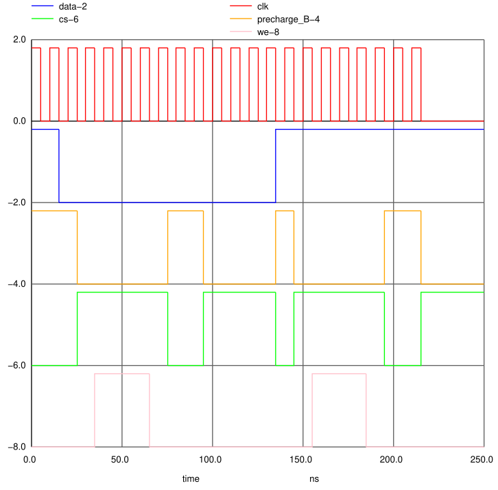

# Wavedrom JSON to NGSpice PWL lines converter

## Purpose

In digital IC design with open source tools (such as Xschem, Magic, Ngspice) we sometimes need to simulate complex CMOS level digital 
circuits using "analog methods". This is different that mixed signal IC design where both spice netlists and HDL code are
mixed together. To form complex input test patterns in Ngspice, the PULSE or PWL can be used. 
This is doable for one or two input signals but when it comes to designing complex circuit e.g., a SRAM memory controller where
there are more than ten input signals, complex digital inputs with complex relative timings must be set. This is tedious and needs
automation.

The PWL on voltage sources in Ngspice allows defining complex input signals. Meanwhile, the [Wavedrom](https://wavedrom.com/) 
editor allows entering digital signals using a graphical user interface (GUI). It visualizes them and allows export in JSON format.

One can write a Python script to convert this Wavedorm generated JSON content to Ngspice PWL lines and then user can easily copy
these generated PWL lines into Xschem spice code symbol, allowing simulation of extremely complex CMOS digital circuits.

## Usage

Create input test pattern in the [Wavedrom](https://wavedrom.com/) and run this Python script to get equivalent PWL lines ready to 
be inserted into Ngspice netlist or Xschem code symbol.

### First design your digital input test pattern in [Wavedrom](https://wavedrom.com/).

For example, enter the following JSON content in Wavedorm editor:

```
{"signal": [
    {"name": "clk", "wave": "p....................."},
    {"name": "data", "wave": "10...........1........"},
    {"name": "precharge_B", "wave": "1.0....1.0...10....1.0"},
    {"name": "CS", "wave": "0.1....0.1...01....0.1"},
    {"name": "WE", "wave": "0..1..0........1..0..."}
]}
```

The output waveform should be similar to the follwoing image:


### Copy the JSON Content into a text file (e.g., wavedrom_input.json)

### Clone this repository and invoke the wavedrom2pwl.py Python script

```
$ git clone https://github.com/ehsan-ali-th/wavedorm2pwl.git
$ cd wavedorm2pwl
```

```
$python3 wavedrom2pwl.py wavedrom_input.json ngspice_output.txt
```
where:
- wavedrom2pwl.py: is this file
- wavedrom_input.json: is a text file containing the Wavedrom JSON. To generate this file simply design your waveform in the the Wavedrom editor and then copy and paste the generated JSON text into 'wavedrom_input.json' file.
- ngspice_output.txt: is the name of output file that will be generated and save in the working directory (the directory where the Python script is invoked) if the conversion is successful.

Notes:
- The JSON input must contain valid JSON text.
- ALL JSON input fields must be double quoted. Look at the provided [wavedrom.json](src/wavedrom.json) sample file.
- wavedrom2pwl.py: This is the main Python script that defines states and run a state machine to convert Wavedrom JSON to NGSpice PWL lines.

### The script generates the ngspice_output.txt file which should have the following content

```
V100 clk GND pwl(0n,1.8 ,5n,1.8, 5n,0, 10n,0, 10n,1.8, 15n,1.8, 15n,0, 20n,0, 20n,1.8, 25n,1.8, 25n,0, 30n,0, 30n,1.8, 35n,1.8, 35n,0, 40n,0, 40n,1.8, 45n,1.8, 45n,0, 50n,0, 50n,1.8, 55n,1.8, 55n,0, 60n,0, 60n,1.8, 65n,1.8, 65n,0, 70n,0, 70n,1.8, 75n,1.8, 75n,0, 80n,0, 80n,1.8, 85n,1.8, 85n,0, 90n,0, 90n,1.8, 95n,1.8, 95n,0, 100n,0, 100n,1.8, 105n,1.8, 105n,0, 110n,0, 110n,1.8, 115n,1.8, 115n,0, 120n,0, 120n,1.8, 125n,1.8, 125n,0, 130n,0, 130n,1.8, 135n,1.8, 135n,0, 140n,0, 140n,1.8, 145n,1.8, 145n,0, 150n,0, 150n,1.8, 155n,1.8, 155n,0, 160n,0, 160n,1.8, 165n,1.8, 165n,0, 170n,0, 170n,1.8, 175n,1.8, 175n,0, 180n,0, 180n,1.8, 185n,1.8, 185n,0, 190n,0, 190n,1.8, 195n,1.8, 195n,0, 200n,0, 200n,1.8, 205n,1.8, 205n,0, 210n,0, 210n,1.8, 215n,1.8, 215n,0, 220n,0)
V101 data GND pwl(0n,1.8 ,15n,1.8, 15n,0, 20n,0 ,135n,0, 135n,1.8, 140n,1.8)
V102 precharge_B GND pwl(0n,1.8 ,25n,1.8, 25n,0, 30n,0 ,75n,0, 75n,1.8, 80n,1.8 ,95n,1.8, 95n,0, 100n,0 ,135n,0, 135n,1.8, 140n,1.8 ,145n,1.8, 145n,0, 150n,0 ,195n,0, 195n,1.8, 200n,1.8 ,215n,1.8, 215n,0, 220n,0)
V103 CS GND pwl(0n,0 ,25n,0, 25n,1.8, 30n,1.8 ,75n,1.8, 75n,0, 80n,0 ,95n,0, 95n,1.8, 100n,1.8 ,135n,1.8, 135n,0, 140n,0 ,145n,0, 145n,1.8, 150n,1.8 ,195n,1.8, 195n,0, 200n,0 ,215n,0, 215n,1.8, 220n,1.8)
V104 WE GND pwl(0n,0 ,35n,0, 35n,1.8, 40n,1.8 ,65n,1.8, 65n,0, 70n,0 ,155n,0, 155n,1.8, 160n,1.8 ,185n,1.8, 185n,0, 190n,0)
```

### Copy the content of the ngspice_output.txt file into Xschem or Ngspice netlist file and run the simulation 

Issuing an Ngspice `plot` command should graph a "true mixed signal input" plot similar to the following image:



- Author: Dr. Ehsan Ali
- Author's email: ehssan.aali@gmail.com
- Last Update: May, 2025 
- Version: 0.1
